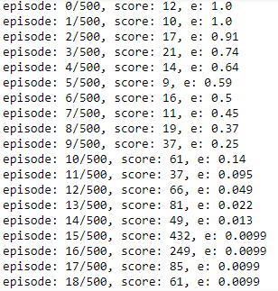

The goal of CartPole is to balance a pole connected with one joint on top of a moving cart in maximum time. There are 4 kinds of information given by the state, such as angle of the pole and position of the cart. An agent will perform actions by either move the cart to left or right (0 or 1) to balance the pole avoid from fall.

The agent is trained to maximize the duration of pole maintain vertically on the moving cart. Below is the cartPole playing automatically to balancing the pole. As shown in result, the higher the episode, the larger value of the score.

Episode will be terminated for following condition:
 •	Pole Angle is more than 12 degrees
 •	Cart Position is more than 2.4 (center of the cart reaches the edge of the display)
 •	Episode length is greater than 200

# Deep Neural Network

Below diagram is a general deep neural network. However, the network used in this CartPole game will have two output nodes since CartPole has two allowed actions, move left or right at each state. 

# Dependencies
<ul>
  <li>TensorFlow</li>
  <li>Keras</li>
  <li>Numpy</li>
  <li>OpenAI Gym</li>
</ul>

# References
https://keon.io/deep-q-learning/
