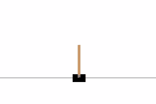

The goal of CartPole is to balance a pole connected with one joint on top of a moving cart in maximum time. There are 4 kinds of information given by the state, such as angle of the pole and position of the cart. An agent will perform actions by either move the cart to left or right (0 or 1) to balance the pole avoid from fall.

# Deep Neural Network

Below diagram is a general deep neural network which is more simple than the network used in this CartPole game. Since CartPole output has two allowed actions, move left or right at each state, therefore, the output node should have two nodes rather than single node. 

# Dependencies
<ul>
  <li>TensorFlow</li>
  <li>Keras</li>
  <li>Numpy</li>
  <li>OpenAI Gym</li>
</ul>

# References
https://keon.io/deep-q-learning/
