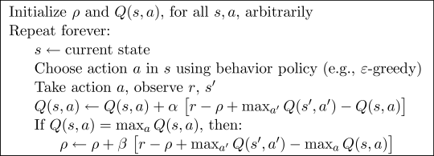

# R-Learning

R-Learning is almost similar as Q-learning which also off-policy control method. The main differences are: 
1. The R-Learning is mainly for undiscounted continue task and weighting near-term reward and future reward equally.
2. The Q approximation of R-Learning based on average reward.

R-Learning consists of behavior policy and an estimation policy. Although it has similar tabular learning structure as Q-learning, but it is not popular as Q-learning approach.

## References
1. Reinforcement Learning: An Introduction, by Richard S. Sutton and Andrew G. Barto, The MIT Press Cambridge, Massachusetts, London, England
2. Schwartz, A. (1993). A reinforcement learning method for maximizing undiscounted rewards. In Proceedings of the tenth international conference on machine learning (Vol. 298, pp. 298-305).